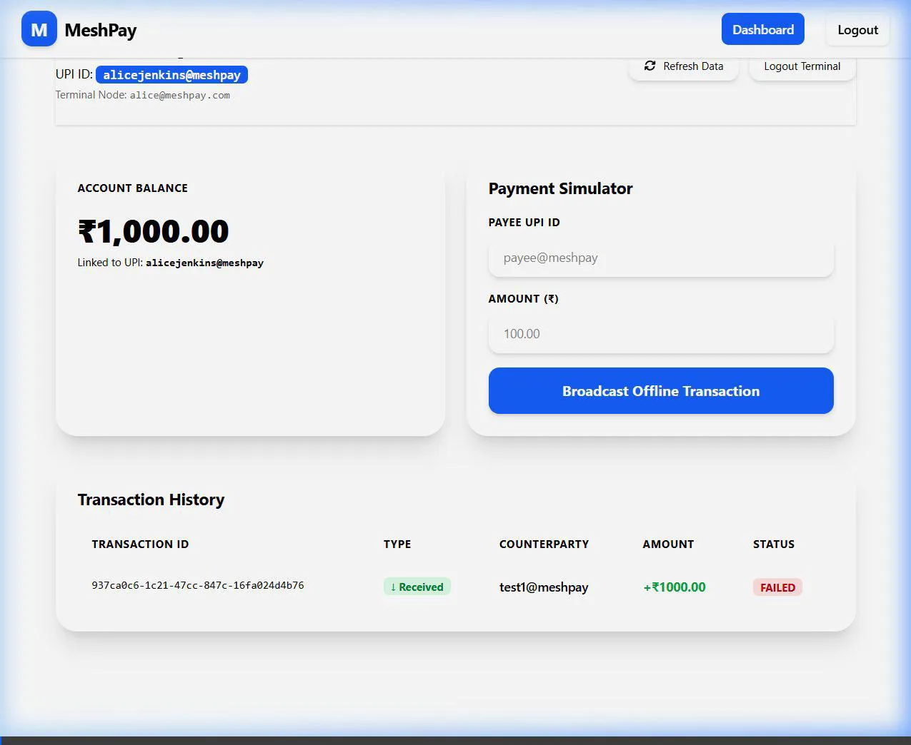

# MeshPay — Distributed Offline Payment Network

MeshPay is a secure, decentralized payment routing simulator mimicking an offline UPI/bank settlement network. It enables users in offline or low-connectivity environments to make secure transactions that propagate hop-by-hop through local mesh networks (e.g., Bluetooth, Wi-Fi Direct) to a gateway node that settles them at the central bank.

---

## 📸 Screenshots

### 1. Unified User Dashboard
Displays current balance, user's permanent UPI ID (`username@meshpay`), email details, a real-time payment simulator form, and transaction ledger.


### 2. Live WebSocket Transaction Tracker
A visual STOMP timeline showing real-time path updates and hops (Transaction Service ➔ Relay-1 ➔ Relay-2 ➔ Gateway ➔ Bank Service) as the transaction is routed off-grid.



---

## 💡 The Problem it Solves

Traditional digital payment networks (like UPI, Visa, or online banking) require all participants to have a persistent, high-speed internet connection. In areas suffering from:
- **Disaster zones** (infrastructure breakdown)
- **Rural/remote areas** (no cellular coverage)
- **Crowded venues** (network congestion)

Users cannot pay for essential goods. 

**MeshPay** solves this by packaging the payment instructions into a secure, encrypted **Packet**. This packet is passed offline from one user terminal to another using local communication networks (simulated via relay services). When the packet finally reaches an internet-connected **Gateway Node** (like a satellite uplink, roadside unit, or merchant terminal), the gateway forwards it online to the **Bank Service** for atomic execution and settlement.

---

## 🛠️ Architecture & Microservices

MeshPay is built as a microservice architecture to decouple offline routing from central banking operations:

1. **User Service (Port 8081)**: Manages authentication, token generation, and automatically assigns a unique UPI ID (`name@meshpay`) derived from the user's name during registration.
2. **Relay Service 1 & 2 (Ports 8082, 8083)**: Simulates local mesh hops. They receive the encrypted packet, validate time-to-live (TTL) and hop counts, append themselves to the routing history, and forward to the next nearest node.
3. **Gateway Service (Port 8084)**: Acts as the edge node. It receives packets from the off-grid mesh and pushes them to the online Bank Service.
4. **Bank Service (Port 8085)**: The source of truth for accounts. It decrypts the payload using its private RSA key, checks balances, performs atomic debit/credit operations, and records ledger entries.
5. **Transaction Service (Port 8086)**: The entry point where transactions are initiated. It encrypts payloads using Hybrid Encryption (AES + Bank's Public RSA Key) and initializes packet metadata.
6. **Frontend (Port 3000)**: A React SPA that provides registration, secure login, a dashboard for simulating offline payments, and a live Stomp WebSocket tracker showing packet hop timelines.

---

## 🔒 Security Features

- **End-to-End Encryption**: Offline relay terminals only forward the packet. They cannot inspect or modify payment details because the payload is encrypted using Hybrid Cryptography (AES-GCM for the payload, with the AES key encrypted using the Bank's RSA Public Key). Only the Bank Service holds the Private RSA Key to decrypt it.
- **Data Integrity**: Packets contain a SHA-256 checksum generated at initiation to prevent tampering during routing.
- **Idempotency**: Prevent double-spending. If a packet is re-routed or delivered multiple times due to mesh retries, the Bank Service matches the unique Transaction UUID and rejects duplicate settlement requests.
- **Terminal State Stability**: Core payment statuses (`SUCCESS`) are terminal. Once a transaction settles at the bank, intermediate routing timeouts or relay failures cannot override the status to `FAILED`.

---

## 🚀 How to Run the Project Locally

Follow these steps to launch the entire network of microservices and the database on your local machine:

### Prerequisites
Make sure you have the following tools installed:
- **Docker & Docker Compose**
- **Java Development Kit (JDK) 21**
- **Node.js & npm** (optional, for running frontend outside Docker)
- **Maven** (for compiling backend services)

### Step 1: Package Backend Services
Clean compile and package the microservices using the Maven parent aggregator at the project root:
```bash
mvn clean package -DskipTests
```
This builds target JARs in each service subdirectory (`user-service/target/*.jar`, `bank-service/target/*.jar`, etc.).

### Step 2: Spin Up Containers
Launch the database, backend microservices, and the Nginx-hosted frontend using Docker Compose:
```bash
docker compose up --build -d
```
This will:
1. Start a MySQL 8.0 container and run database initialization scripts (`mysql-init/init.sql`).
2. Boot all 6 Spring Boot microservices.
3. Boot the React Frontend web client.

### Step 3: Access the Application
Open your browser and navigate to:
```
http://localhost:3000
```

- **Register** a new account (e.g. "Alice Jenkins") and specify an **Initial Balance** (e.g. ₹10,000). The system will automatically create your unique UPI ID: `alicejenkins@meshpay`.
- **Log In** and use the **Payment Simulator** on the dashboard to test transactions by broadcasting offline payments to other valid UPI IDs.
- Watch the **Live Transaction Tracker** timeline trace the packet through all 5 routing hops in real-time.

---

## 🛠️ Stop and Cleanup
To shut down all containers and clean up the database volumes:
```bash
docker compose down -v
```
